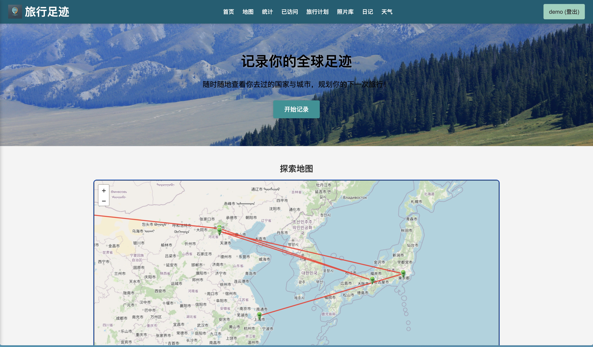

# 旅行足迹 Travel Tracker v2.0

一款功能丰富的旅行足迹追踪Web应用，让你轻松记录和管理你的全球旅行经历。



## 功能特点

### 核心功能
- **用户账户管理**: 简单的用户登录/注册功能
- **旅行地图**: 使用Leaflet实现的交互式地图，显示已访问和计划访问的地点
- **已访问记录**: 记录和管理你已经去过的国家和城市
- **旅行计划**: 添加和管理你计划访问的地点
- **地点搜索**: 使用Nominatim API搜索全球城市和地点

### 增强功能
- **旅行统计**: 可视化展示你的旅行数据，包括国家覆盖率、年度统计等
- **照片库**: 上传、管理和查看你的旅行照片
- **旅行日记**: 记录每次旅行的心情和体验
- **天气信息**: 查看已访问和计划访问地点的实时天气和预报
- **离线支持**: 通过Service Worker实现的离线访问功能
- **移动端适配**: 响应式设计和触摸手势支持，优化移动设备体验

## 目录结构

```
travel-tracker/
 ├─ assets/
 │   ├─ images/       # 图标和图片资源
 │   ├─ markers/      # 地图标记图标
 │   └─ icons/        # UI 图标
 ├─ data/
 │   ├─ user-data.json      # 用户数据 (已访问国家, 旅行计划)
 │   ├─ locations.json      # 地点数据 (坐标等)
 │   ├─ photos.json         # 照片数据
 │   └─ diaries.json        # 日记数据
 ├─ scripts/
 │   ├─ data.js             # 数据处理
 │   ├─ main.js             # 主逻辑
 │   ├─ map.js              # 地图相关
 │   ├─ geo.js              # 地理位置相关
 │   ├─ countries.js        # 国家数据
 │   ├─ utils.js            # 通用工具函数
 │   ├─ mobile-enhancements.js  # 移动端优化
 │   ├─ statistics.js       # 统计功能
 │   ├─ gallery.js          # 照片库功能
 │   ├─ diary.js            # 日记功能
 │   └─ weather.js          # 天气功能
 ├─ server/
 │   ├─ routes/
 │   │  └─ api.js           # API 路由
 │   └─ app.js              # 服务器入口
 ├─ styles/
 │   ├─ main.css            # 主样式
 │   └─ map.css             # 地图样式
 ├─ index.html              # 主页面
 ├─ offline.html            # 离线页面
 ├─ service-worker.js       # Service Worker
 ├─ package.json
 ├─ run.sh                  # 启动脚本
 └─ README.md
```

## 环境准备
 - Node.js >= 14
 - npm (或 yarn)
 - 若需用到脚本或 App 的“一键运行”，在 Mac 上可创建 Automator App
   或使用 run.sh + Terminal。

### 方法一: 命令行
```bash
# 安装依赖
npm install

# 启动服务器
node server/app.js

# 访问 http://localhost:3001
```

### 方法二: 使用启动脚本
```bash
# 赋予执行权限
chmod +x run.sh

# 运行脚本
./run.sh
```

### 方法三: Mac上一键运行 - 两种方式

  (A) 使用 run.sh 脚本
   1) 在项目根目录有 run.sh
   2) 让其可执行: chmod +x run.sh
   3) 双击 run.sh （若 Finder 上双击不行，可右键 -> Open，或在 Terminal 执行 ./run.sh）
      它会自动启动 Node 服务并 open http://localhost:3001

  (B) 用 Mac Automator 制作一个 “旅行足迹.app”
   1) 打开 Automator，选 “应用程序(Application)”
   2) 在左边搜索 “运行 Shell 脚本(Run Shell Script)” 拖到右侧
   3) 在命令框里写下大致逻辑：
       cd /该项目的路径
       npm install  # 如果需要
       node server/app.js &  # 后台启动
       sleep 2
       open http://localhost:3001
   4) 存成 “旅行足迹.app”（比如放到项目下的 MacApp/ 目录）
   5) 现在只要双击 “旅行足迹.app”，它会自动运行脚本、启动服务器并用浏览器打开

## API 说明

### 1. 用户数据 API
- `GET /api/user-data` - 获取所有用户数据
- `POST /api/user-data` - 更新用户数据

### 2. 地点 API
- `GET /api/locations` - 获取所有地点数据
- `POST /api/locations` - 添加新地点
- `POST /api/locations/remove` - 删除地点
- `PATCH /api/locations` - 更新地点类型

### 3. 照片 API
- `GET /api/photos` - 获取所有照片
- `POST /api/photos` - 上传新照片
- `GET /api/photos/:id` - 获取特定照片
- `DELETE /api/photos/:id` - 删除照片

### 4. 日记 API
- `GET /api/diaries` - 获取所有日记
- `POST /api/diaries` - 添加或更新日记
- `GET /api/diaries/:id` - 获取特定日记
- `DELETE /api/diaries/:id` - 删除日记

## 使用的第三方库

- **Leaflet**: 交互式地图
- **Chart.js**: 数据可视化
- **Font Awesome**: 图标库
- **OpenWeatherMap API**: 天气数据 (需要自己的API密钥)

## 离线功能

此应用支持基本的离线功能:

1. 静态资源缓存 - CSS, JS, 图片等
2. 已访问过的页面可离线访问
3. 服务中断时显示离线页面
4. 恢复连接后自动刷新数据

## 贡献者

- Lixin Li

## 许可证

此项目采用 MIT 许可证 - 详见 [LICENSE](LICENSE) 文件
